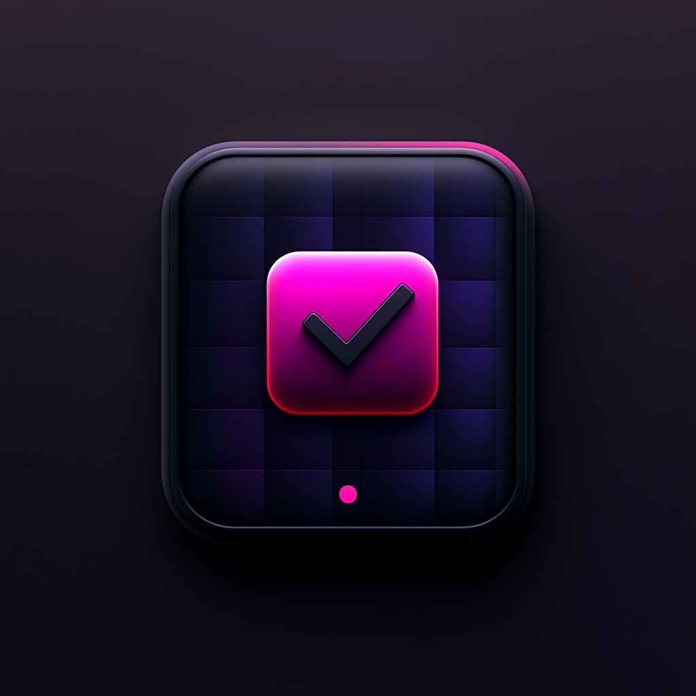

<h1 align="center">
   
  Todoclist
</h1>

A terminal-based Todoist client with the following features:

- View and manage tasks from Todoist

## Roadmap

- [X] Synchronise tasks from local to cloud
- [X] Share tasks between Today and Inbox
- [ ] Display more information (e.g. details/ priority/ date)
- [ ] Add tasks
- [ ] Add tests
- [ ] Add tasks from inbox to today
- [ ] Add more key bindings for easier moving
- [ ] Handle projects
- [ ] Run sync in the background remaining a local copy

... future ...
- [ ] Create recurring tasks

### Requirements

- Rust 1.65+
- Todoist API key

### Configuration

On first run, you'll be prompted to enter your Todoist API key. This will be securely stored in your system's config directory.
